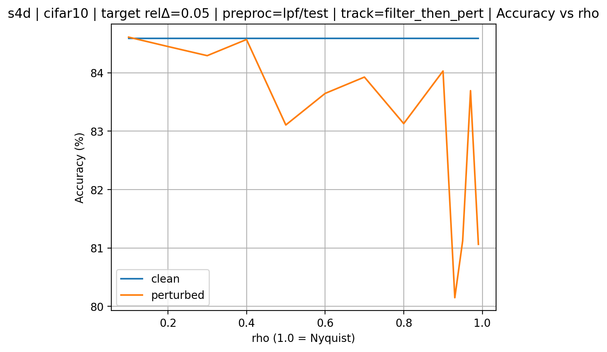

# Topo_S4 (WIP)
**Frequency-localized sensitivity** in sequence models (S4/S4D) and simple mitigations via
**PC-band** (phase-coherent bandlimiting) and **PC-weight** (phase-coherent weighting).

Project homepage: https://dongyeongkim22.github.io/Topo_S4/  
Overleaf draft: https://www.overleaf.com/read/qvvrpygjhbvv#15a2ec  
Repo: https://github.com/DongyeongKim22/Topo_S4

---

## Motivation (high level)
A working hypothesis is that **near-Nyquist digital frequencies** (Ω → π) can become numerically
over-sensitive under bilinear/Tustin discretization due to frequency warping:

  $$\omega(\Omega)=\frac{2}{\Delta}\tan(\Omega/2), \quad
  \frac{d\omega}{d\Omega}=\frac{1}{\Delta}\sec^2(\Omega/2)$$

so sensitivity grows rapidly as Ω approaches π. If inputs contain strong near-Nyquist components,
training/evaluation can exhibit sharper degradation.

---

## What this repo contains
- **Single-mode Fourier injection** benchmark: sweep normalized frequency ρ ∈ [0, 1] (ρ=1 is Nyquist)
  and measure accuracy drop vs frequency.
- **Filtering baselines** (guard band / low-pass).
- **Two-track evaluation protocol** to disentangle “removing perturbation” vs “changing sensitivity”:
  - `filter_both`: evaluate `F(u + δ)` (filter can remove the injected perturbation)
  - `filter_then_pert`: evaluate `F(u) + δ` (perturbation stays intact → probes post-filter sensitivity)
- **PC-band (phase-coherent bandlimiting)** preprocessing:
  offline estimation of an effective bandwidth + cached roll-off mask (keep-budget via `--pc_keep_ratio`).
- **PC-weight (phase-coherent weighting)** preprocessing:
  soft mask with keep-budget via `--pc_target_mean_w` (automatic tau search to match mean(W)).
- **preproc_scope ablation** (`train` / `test` / `both`) to check distribution shift and generalization
  when applying PC during training vs evaluation.

> Note: the **mask is computed once and cached**; it is applied during training/evaluation.

---

## Results (Preliminary)

### 1) sCIFAR10 / CIFAR10: accuracy vs frequency (ρ sweep)
Setting: `s4d | cifar10 | target relΔ=0.05 | preproc=lpf(test) | track=filter_then_pert`

Observation: clean accuracy stays stable; perturbed accuracy drops sharply near **high ρ** (near Nyquist).

---

### 2) DTD96: PC-band improves mean best test accuracy (3 seeds)
S4D, seeds 0/1/2 (preliminary). PC-band keep_ratio=0.90 improves mean best test accuracy.

| Setting | keep_ratio | Mean Best Test (%) | Δ vs Raw (pp) |
|---|---:|---:|---:|
| Raw | -- | 36.42 | 0.00 |
| PC-band | 0.90 | 37.41 | +0.99 |

> Per-seed breakdown can be added later once final settings are chosen.

---

### 3) sCIFAR10 sanity check (seed 0)
This is mainly to validate the preprocessing pipeline end-to-end; effects are small here.

| Setting | Best Val (%) | Test @ Best Val (%) | Best Test (%) |
|---|---:|---:|---:|
| Raw | 89.08 | 88.69 | 88.78 |
| PC-band (keep_ratio=0.80) | 89.16 | 88.54 | 88.58 |

---

### 4) Pathfinder32 added (pilot sweeps; 5 epochs)
Compute is currently the main bottleneck, so I run **short 5-epoch sweeps** to narrow down promising
PC hyperparameters before doing full-epoch runs. These pilots are **for hyperparameter selection / effect direction**,
not final reported results.

**Trend:** applying PC **consistently during training and evaluation** (`preproc_scope=both`) tends to generalize better
than mismatched scopes (especially for **PC-weight**, which can collapse under scope mismatch).

Pathfinder32 (seed 0, **5 epochs**; metric = **test @ best dev**):

| Setting | scope | budget | Test @ Best Dev (%) |
|---|---|---:|---:|
| Raw | both | -- | 77.00 |
| PC-band | both | keep_ratio=0.90 | 76.79 |
| PC-weight | both | target_mean_w=0.40 | 77.76 |

Scope mismatch example (same pilot setting):
- PC-weight (target_mean_w=0.40, **scope=test-only**): 49.93 (large drop → distribution shift)

> Next: add **full-epoch** results for the selected PC settings. After narrowing down hyperparameters,
> evaluate on **SC35** (compute-heavy in my setup: ~90 min/epoch).

---

## Repro (minimal notes)
- Track definitions:
  - `filter_both`: `F(u+δ)`
  - `filter_then_pert`: `F(u)+δ`
- See scripts/flags in the repo for dataset + model configs.

---

## Status
Work in progress.

Next steps:
- Continue keep-budget selection with short sweeps (≤5 epochs) under limited compute.
- Run **full epochs** (paper-aligned settings) for the best PC-band / PC-weight configurations.
- Move to **SC35** (≈90 min/epoch in my setup) after narrowing down hyperparameters.
