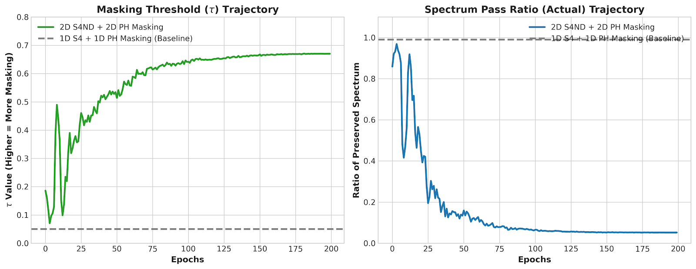

# Topo_S4 (WIP)

**Frequency-localized sensitivity** in state space models (**S4 / S4D / S4ND**) and simple-to-adaptive spectral mitigations, from early **PC-band / PC-weight** preprocessing to the current **dynamic PH-masking** line.

- **Project homepage:** https://dongyeongkim22.github.io/Topo_S4/
- **Overleaf draft:** https://www.overleaf.com/read/qvvrpygjhbvv#15a2ec
- **Repo:** https://github.com/DongyeongKim22/Topo_S4

## Motivation

A working hypothesis is that **near-Nyquist digital frequencies** (`Ω -> π`) can become numerically over-sensitive under bilinear/Tustin discretization due to frequency warping:

$$
\omega(\Omega)=\frac{2}{\Delta}\tan(\Omega/2), \qquad
\frac{d\omega}{d\Omega}=\frac{1}{\Delta}\sec^2(\Omega/2)
$$

so sensitivity can grow rapidly as `Ω` approaches `π`. If inputs contain strong near-Nyquist components, training and evaluation may exhibit sharper degradation.

The current question is no longer only **whether** high-frequency vulnerability exists, but also **how to localize and control it** without collapsing useful structure.

## Current direction: Dynamic PH masking

The repository started with **dataset-level PC masks**:
- **PC-band**: phase-coherent hard bandlimiting
- **PC-weight**: phase-coherent soft weighting

The current active direction is **sample-wise dynamic PH masking**:
- compute **exact PH descriptors** on each sample's spectrum,
- predict masking parameters (e.g., `τ`, `α`) with a lightweight controller,
- and apply a **sample-specific spectral mask** before the unchanged S4/S4ND backbone.

This shift was motivated by a limitation of global PC masks: a dataset-wide prior can suppress weak-but-useful high-frequency structure by averaging it away.

## What this repo contains

- **Single-mode Fourier injection benchmark**: sweep normalized frequency `ρ in [0, 1]` (`ρ=1` is Nyquist) and measure accuracy drop vs. frequency.
- **Filtering baselines**: guard band and low-pass filtering.
- **Two-track evaluation protocol** to disentangle “removing the perturbation” vs. “changing sensitivity”:
  - `filter_both`: evaluate `F(u + δ)`
  - `filter_then_pert`: evaluate `F(u) + δ`
- **PC-band / PC-weight** preprocessing: dataset-level spectral masks estimated once and cached.
- **Dynamic PH masking (current)**:
  - **1D S4 / S4D + 1D PH** for native 1D sequence settings,
  - **2D S4ND + 2D PH** for image settings where preserving spatial structure is important.
- **preproc_scope ablation** (`train` / `test` / `both`) to study distribution shift and scope-dependent generalization.

## Recent findings (current snapshot)

### 1) From global PC to sample-wise PH

I implemented an exact **sample-wise PH-based dynamic masking module** that replaces the earlier dataset-level PC prior.

- For each sample, compute a spectral representation.
- Extract exact PH features (currently H0 superlevel persistence in 1D/2D settings).
- Use a small controller to predict masking parameters.
- Apply the mask before the unchanged S4/S4ND backbone.

The target complexity remains near **`O(N log N)`**, where `N` is the number of candidate spectral cells/bins processed by the PH sweep.

### 2) 1D flattened-image experiments: controller collapse to near-identity

Initial experiments on **sequential CIFAR-10 / flattened Pathfinder32** with **1D S4 + 1D PH masking** did **not** show a consistent clean-accuracy gain.
Depending on the dataset and setting, the result was either marginally positive or slightly negative.

The more important observation was mechanistic:
- the masking threshold `τ` converged toward its lower bound,
- the actual spectrum pass ratio stayed close to 1,
- and the controller behaved like a **near-identity fail-safe**.

A working interpretation is that **flattening a 2D image into a 1D sequence introduces flattening-induced spectral distortion**. In that setting, aggressive 1D spectral masking can damage real spatial structure (e.g., edges/shapes), so optimization prefers to keep the mask close to identity.

### 3) 2D validation with S4ND + 2D PH

To test whether the earlier collapse came from the PH mechanism itself or from the **2D → 1D mismatch**, I moved the image-side experiments to **S4ND + 2D PH masking**.

On Pathfinder32, the controller now behaves very differently:
- `τ` rises actively over training instead of collapsing to the minimum,
- the actual spectrum pass ratio decreases substantially,
- and the mask starts filtering rather than staying near identity.

This does **not** yet establish a strong final performance claim. Current Pathfinder32 numbers are still preliminary (roughly `50% -> 53%`), but the controller dynamics are much more informative: the masking module is now **actually engaging**.

**Interpretation:** the 2D result is more consistent with the intended mechanism. It suggests that the earlier 1D collapse is better explained by the **dimensional mismatch of flattening** than by a failure of PH itself.

### 4) Why this matters for the next benchmark

These results suggest a simple split:
- **native 1D signals** should be studied with **1D S4/S4D + 1D PH**,
- **native 2D images** should be studied with **S4ND + 2D PH** when the goal is to preserve the original spatial topology.

That makes **SC35** the next decisive benchmark.

## This week's progress update

- Reframed the project from **global, dataset-level PC masking** toward **sample-wise dynamic PH masking**.
- Implemented exact **1D / 2D PH-based masking controllers** for S4 and S4ND.
- Observed **near-identity collapse** in 1D flattened image settings (`τ -> τ_min`, pass ratio near 1).
- Interpreted that collapse as being **consistent with flattening-induced spectral distortion**, rather than as a direct failure of PH logic.
- Switched image-side experiments to **S4ND + 2D PH** and confirmed that the controller now **activates and masks nontrivially**.
- Prepared the next-stage hypothesis test on **Speech Commands 35 (SC35)**.

## Next steps

- Run the next **SC35** comparison:
  - **Pure S4 baseline**
  - **1D S4 + dynamic PH masking**
- Measure not only accuracy, but also:
  - `τ` trajectory,
  - actual pass ratio,
  - and the variance/collapse behavior of the controller.
- Continue Pathfinder32 with the 2D pipeline to determine whether the new controller activation translates into stable accuracy gains.
- Revisit whether **global PC masks** remain useful as cheap baselines, or whether the main line should move fully to **dynamic PH masking**.

## Repro (minimal notes)

- Track definitions:
  - `filter_both`: `F(u+δ)`
  - `filter_then_pert`: `F(u)+δ`
- Image-side PH experiments are now split into:
  - **flattened 1D sequence experiments** for comparison with classic LRA-style settings,
  - **2D S4ND experiments** for structure-preserving validation.
- See scripts/flags in the repo for dataset and model configs.

## Status

Work in progress.
